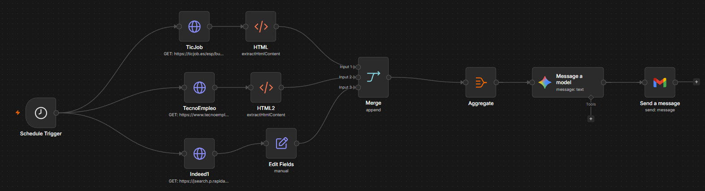

# AI-Powered Job Search Automation (n8n + Docker) 🤖💼

Este proyecto consiste en un pipeline de automatización inteligente (IPA) diseñado en **n8n** y desplegado en contenedores **Docker**. Su objetivo es optimizar y centralizar la búsqueda de empleo en el sector tecnológico, extrayendo ofertas de múltiples plataformas, procesándolas mediante Inteligencia Artificial (LLM) y enviando un boletín curado por correo electrónico.

---

## ⚙️ Arquitectura del Flujo

El flujo de trabajo automatiza el ciclo completo de adquisición, transformación y filtrado de datos:



1. **Disparador Cron (`Schedule Trigger`):** Ejecuta el pipeline de forma totalmente automatizada en intervalos de tiempo programados.
2. **Ingesta Multiplataforma (Extracción en Paralelo):**
   - **TicJob & TecnoEmpleo:** Peticiones HTTP de scraping para obtener las últimas ofertas del sector TI.
   - **Indeed (JSearch API via RapidAPI):** Consumo de API REST estructurada para aplicar filtros avanzados de vacantes.
3. **Normalización y Transformación de Datos:**
   - Nodos de extracción HTML para parsear e higienizar el contenido web no estructurado.
   - Transmutación de campos y mapeo manual (`Edit Fields`) para unificar las diferentes estructuras de datos en un formato homogéneo.
4. **Agregación y Consolidación:** Unificación de flujos mediante el nodo `Merge` (Append) y empaquetado estructurado con `Aggregate`.
5. **Capa de Inteligencia Artificial (`Message a Model`):** Evaluación contextual del consolidado de ofertas mediante un modelo de lenguaje (LLM). El modelo actúa como filtro inteligente, descartando duplicados, evaluando requisitos y resumiendo las propuestas más atractivas.
6. **Notificación Automatizada (Gmail):** Envío de un correo electrónico formateado con el listado final depurado y optimizado listo para postulación.

---

## 🛠️ Tecnologías Utilizadas

- **Orquestador:** n8n (Self-hosted)
- **Infraestructura:** Docker / Docker Compose
- **Entorno de Operación:** Linux / WSL2
- **Integraciones:** Gmail API, HTTP Scraping, REST APIs (JSearch), Inteligencia Artificial (Advanced AI Nodes).

---

## 📂 Estructura del Repositorio

```text
n8n_job_search/
├── n8n_data/                       # Volúmenes locales (Ignorado en el repositorio por seguridad)
├── docker-compose.yml              # Definición de la infraestructura y variables de entorno
├── .gitignore                      # Exclusión de asignación física local (seguridad de credenciales)
├── Búsqueda de puestos laborales.json  # Workflow exportado listo para importar en n8n
├── workflow.png                    # Captura visual del mapa de nodos
└── README.md                       # Documentación del proyecto
```

---

## 🚀 Instalación y Despliegue Portable

Este entorno ha sido diseñado bajo principios de portabilidad estricta. Para replicar este ecosistema localmente, solo requiere clonar el repositorio y levantar el servicio:

1. **Clonar el proyecto:**
   ```bash
   git clone [https://github.com/maximiliano-suarez-baez/n8n-job-search.git](https://github.com/maximiliano-suarez-baez/n8n-local-automation)
   cd n8n-job-search
   ```

2. **Desplegar el contenedor con Docker Compose:**
   ```bash
   docker compose up -d
   ```

3. **Importar el Flujo de Trabajo:**
   - Abra su navegador web en `http://localhost:5678`.
   - Cree su cuenta inicial si es la primera vez que inicia n8n.
   - Vaya al menú de opciones arriba a la derecha, seleccione **Import data desde archivo** y cargue el fichero `Búsqueda de puestos laborales.json`.
   - Configure sus credenciales personales en los nodos correspondientes (Gmail, RapidAPI, LLM).

---

## 🔒 Buenas Prácticas de Seguridad Implementadas

- **Aislamiento de Datos Físicos:** El almacenamiento de credenciales y bases de datos SQLite internas de n8n se gestiona en un volumen local parametrizado (`n8n_data/`), el cual está estrictamente ignorado por el sistema de control de versiones mediante `.gitignore` para evitar fugas de API Keys o tokens de sesión.
- **Portabilidad de Rutas:** Uso de mapeo de volúmenes mediante rutas relativas (`./n8n_data`), garantizando que el entorno se construya idénticamente en cualquier máquina (Windows/Mac/Linux) sin depender de rutas absolutas del sistema anfitrión.

